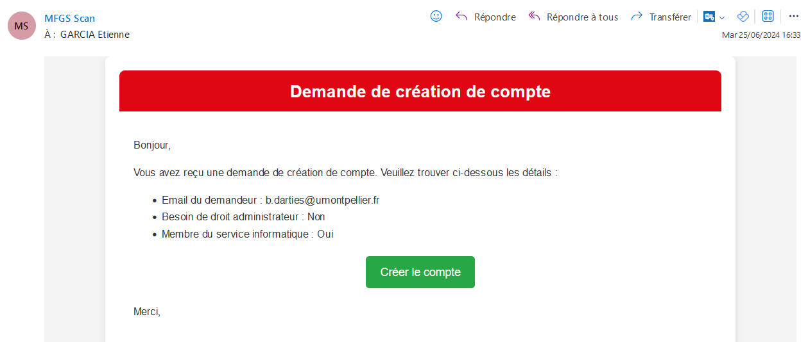
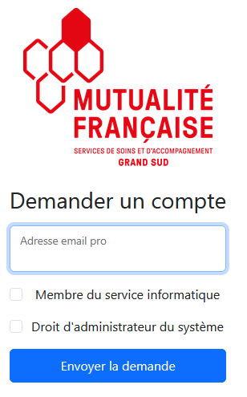
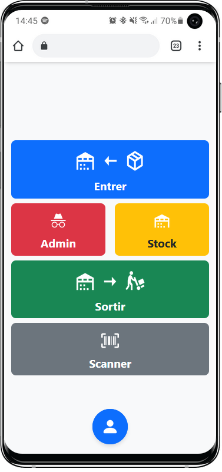

Stock MFGS
======

Ce projet consite en la création d'une application web 
pour la gestion du stock de la mutualité française

## <u>Liens utiles :</u>

https://www.youtube.com/watch?v=jBKqA8FFpIM  
https://socket.io/docs/v4/tutorial/api-overview  
https://getbootstrap.com/docs/5.3/getting-started/introduction/  
https://nodemailer.com/about/  
https://dev.to/victrexx2002/introduction-to-ejs-a-guide-to-building-dynamic-web-applications-2737  

## <u>Screen interfaces :</u>

## <u>Base de donnée :</u>

https://dbdiagram.io/d/diagram-db-MFGS-64cbc0bb02bd1c4a5e32bd60
